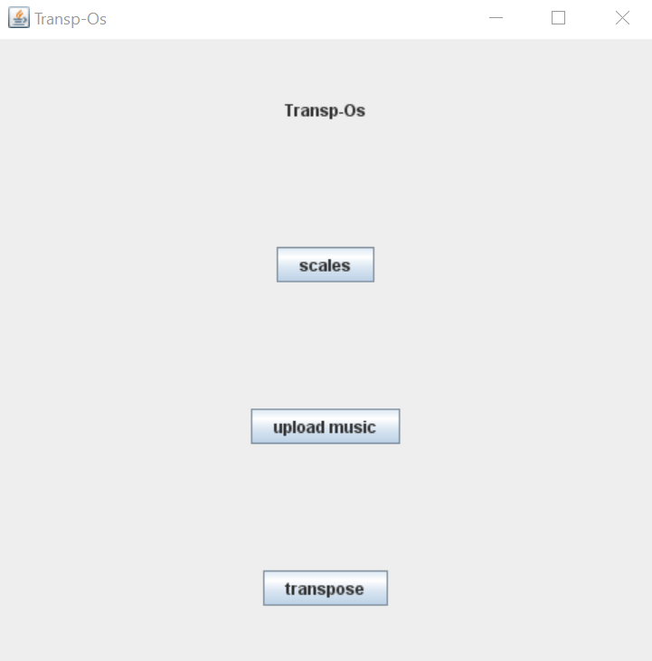
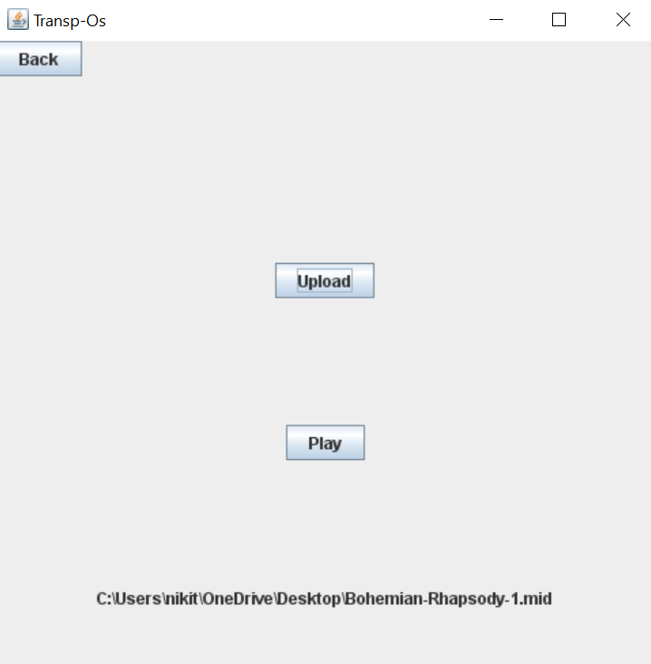
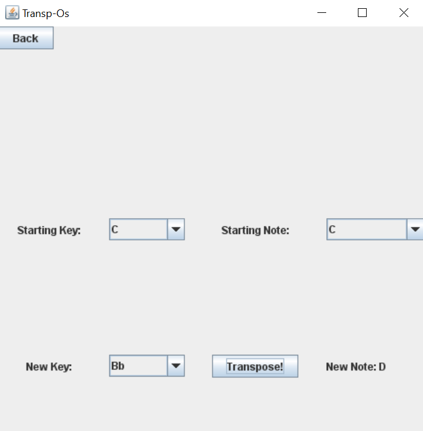

# Transp-Os

**Authors**: Nikitha Nagumalli and Jules Suarez

### Libraries:
 - JFugue: https://github.com/dmkoelle/jfugue
 

 

 
### Application:  
- Transp-Os has three uses:
  - Transposing and playing musical scales:
    - Program allows users to transpose the C scales up or down an indicated half step value.
    - The user has the option to have the scale played in reverse after gitting the top.
  - Uploading and playing a midi file:
    - Program allows users to upload and play a midi (.mid) file.
  - Transposing notes between instrument keys: 
    - Using the Circle of Fifths, the program allows users to tranpose a note between two instrument keys.
    - For example, if a user wants to transpose the note "C" on a Flute (Key of C) to a note on the Clarinet (Key of Bb),
      the program would return the note "D".
